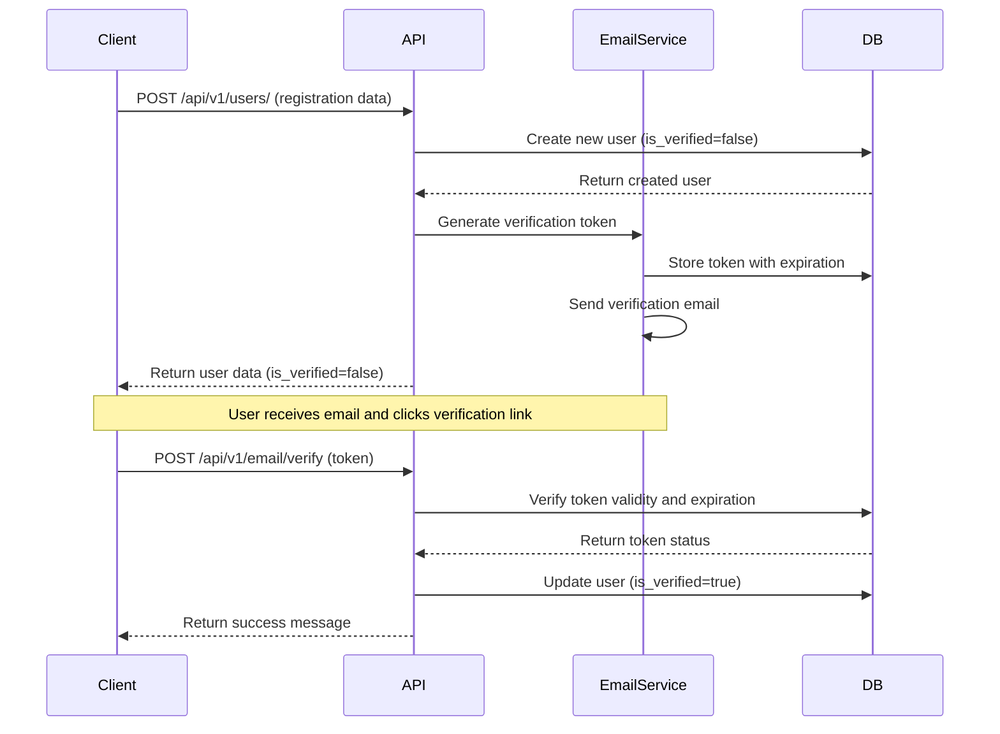
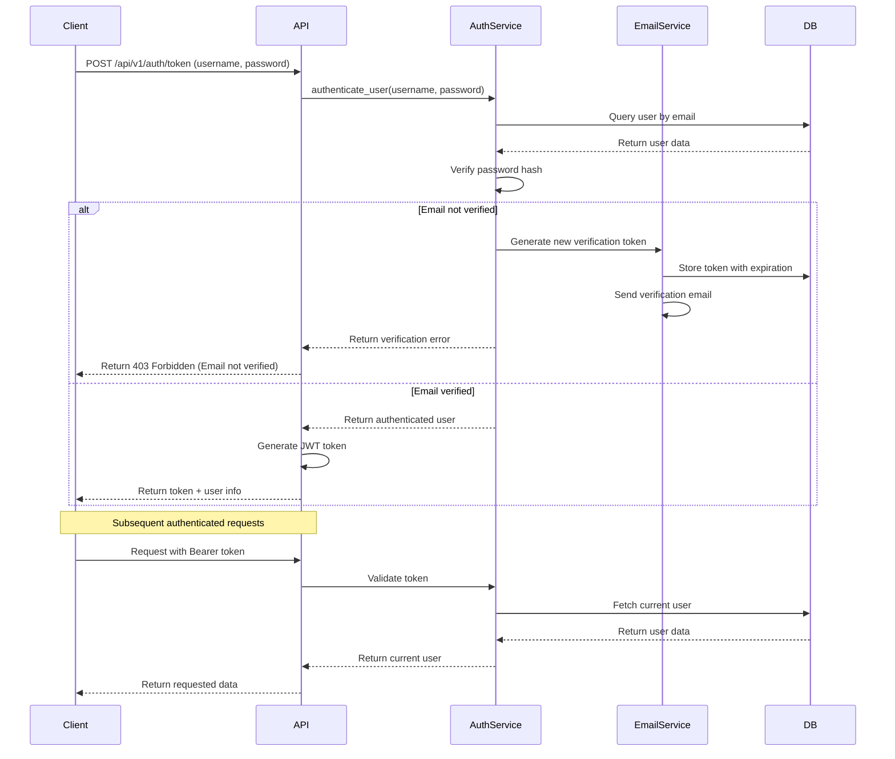
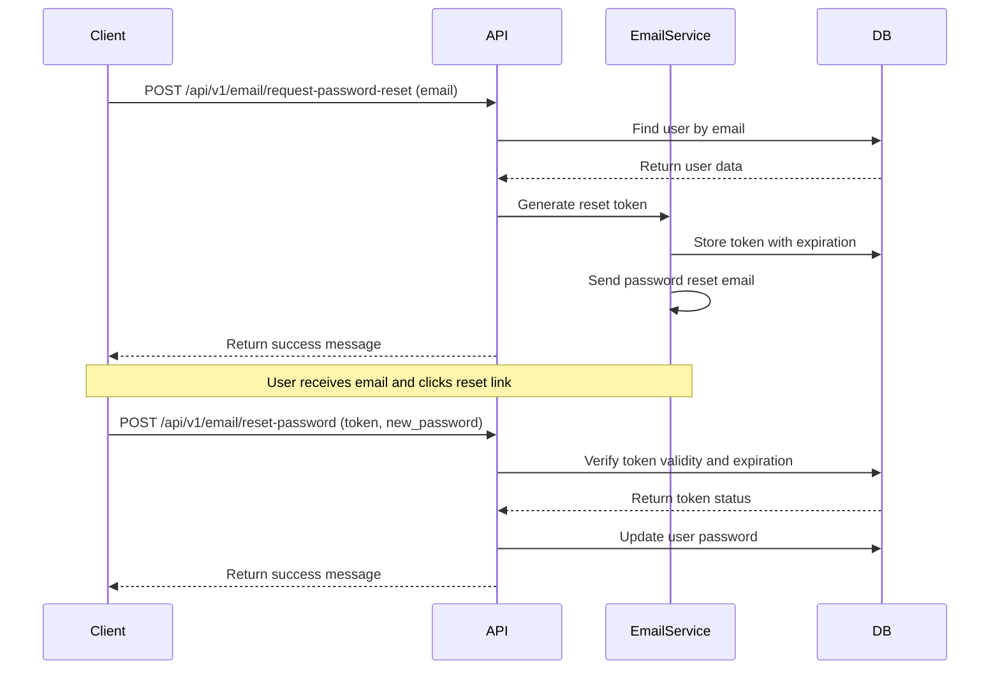

# Authentication Flow

This document describes the authentication flow in the RideShare application, including user registration, email verification, login, and password reset.

## Registration and Email Verification Flow

## Login Flow

## Password Reset Flow

